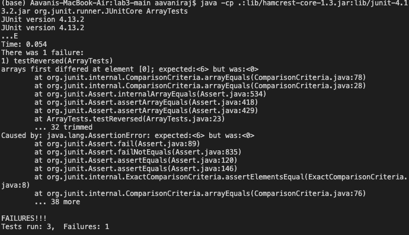

# Lab Report 2
## Part 2:

- The methods in my code are called handleRequest, and there is a main method. 
- The relevant argument for handleRequest is url which takes in an argument in the form of /add-message?s=<string>. Relevant fields of the class are this.path which is set equal to path (the parameter of the class StringHandler) and this.lines which is set equal to Files.readAllLines(Paths.get(path)). 
- The value of the field this.path changes based on the argument given to the class StringHandler. The value of the field this.lines changes based on how the path field changes.
 

## Part 2:


Failure inducing input:
```
@Test
  public void testReversed() {
    int[] input = {4, 5, 6};
    assertArrayEquals(new int[]{6, 5, 4}, ArrayExamples.reversed(input));
  }
 ```

Input that doesn't induce failure:
```
@Test
  public void testReversed() {
    int[] input1 = { };
    assertArrayEquals(new int[]{ }, ArrayExamples.reversed(input1));
  }
```
Symptom/Ouput: 

Code with bug:
```
static int[] reversed(int[] arr) {
    int[] newArray = new int[arr.length];
    for(int i = 0; i < arr.length; i += 1) {
      arr[i] = newArray[arr.length - i - 1];
    }
    return arr;
  }
```

Code without bug:
```
static int[] reversed(int[] arr) {
    int[] newArray = new int[arr.length];
    for(int i = 0; i < arr.length; i += 1) {
      newArray[i] = arr[arr.length - i - 1];
    }
    return newArray;
  }
 ```
 
The fix addresses this issue because arr and newArray need to be switched so that newArray[i] = arr[arr.length - i - 1] and not the other way around (arr[i] = newArray[arr.length - i - 1]).

## Part 3:
Something that I learned fromlab in week 2 is how to work build and run a server and work with code that corresponds to it. I learned about how the The URLHandler Interface works as well as what ports are and what the localhost is.  
